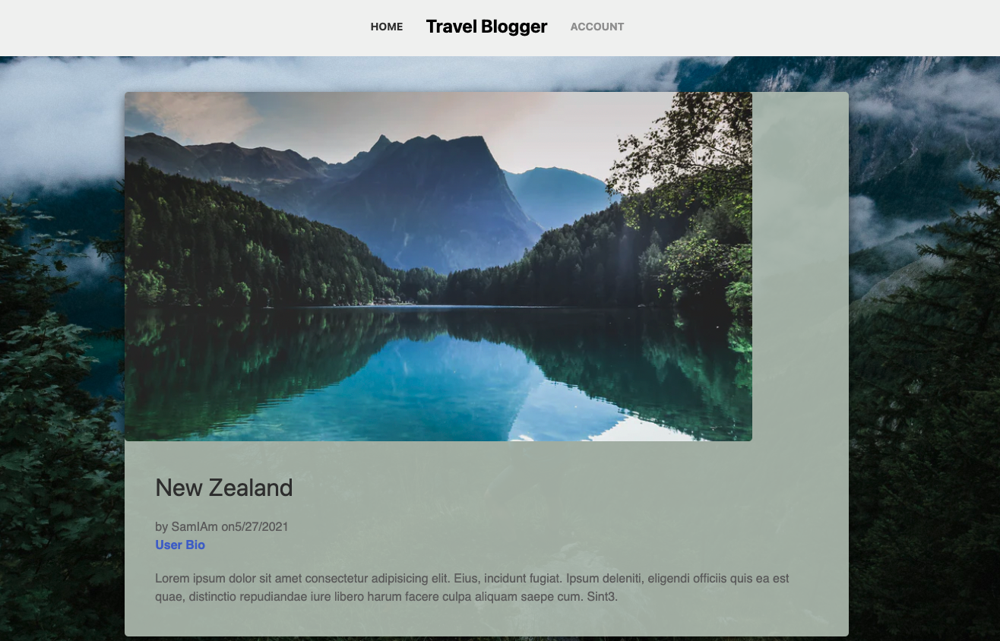

# Travel-Blogger
  
  ## Description: 
  Travel Blogger is a site for travelers to meet, share experiences, stories, photos, and plan future trips. The inspiration for the site was the inability to travel for the past year due to Covid-19 and the need to connect with others. Travel Blogger allows people who may not have friends or family who have interest in travel, but would like to share stories or meet new travel friends with people who share their passion for traveling.
  
  The web application uses Node.js and Express.js to create a RESTful API, Handlebars.js as a templating engine, MySQL and Sequelize ORM for the database, uses GET and POST routes for storing and retrieving data, dotenv and bcrypt for securing sensitive data, passport for user authentication, and UIkit for front-end frameworking.
 
 Note: Users cannot upload photos at this time. This feature will be added in future deployments.
 
 
  ## Table of Contents
  * [Installation](#installation) 
  * [Contributers](#contributers)
  * [Questions](#questions)
  
  ## Installation
  To install the application clone the following [Github repository](https://github.com/enzonsn/TravelBlogger.git) to your computer. Create a .env file in the root of your directiory and add the following:

      DB_NAME='travel_blog'
      DB_USER='root'
      DB_PW= '<your password>'
  
  
  ## Contributers:
  [jacobduden](https://github.com/jacobduden), [enzonsn](https://github.com/enzonsn), [0Blockaye0](https://github.com/0Blockaye0)
  

  ## Questions:
  If you have any questions, please feel free to contact me at enzonsperduti@gmail.com. For more of my work, visit [Enzonsn](https://github.com/enzonsn).
